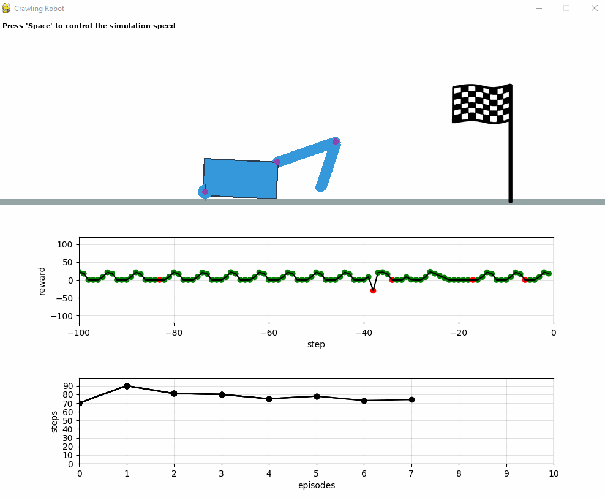
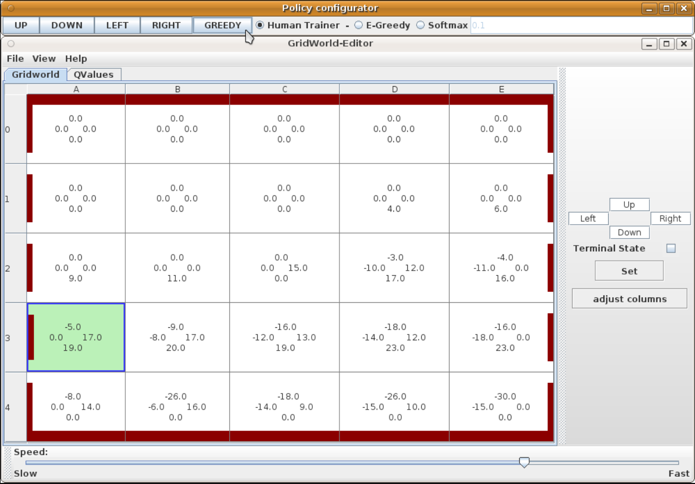

# gym-crawlingrobot

Crawling Robot 2D Simulation with physics behavior.



# Used librarys with Python 3.7

- Pygame for GUI
- Pymunk for Physics


# Installation
``` bash
git clone git@github.com:micheltokic/crawlingrobot.git

pip install tensorflow==1.15.0
pip install -e crawlingrobot
```
## possible errors during experiments
If your Python kernel dies during the experiment and you receive the following error just update your NVIDIA driver to the latest version: 
  2022-05-26 00:28:32.360589: F tensorflow/stream_executor/lib/statusor.cc:34] Attempting to fetch value instead of handling error Internal: failed to get device attribute 13 for device 0: CUDA_ERROR_UNKNOWN: unknown error
  [I 00:28:38.402 NotebookApp] KernelRestarter: restarting kernel (1/5), keep random ports


## Example for usage
``` Python
import gym
import gym_crawlingrobot

# crawlingrobot discrete environment for Reinforcement Learning algorithm e.g. Q-Learning
env = gym.make('crawlingrobot-discrete-v1', rotation_angles=5, goal_distance=2500, window_size=(1500, 800))
env.reset()
...

# crawlingrobot continuous environment for Reinforcement Learning algorithm e.g. PPO2
env = gym.make('crawlingrobot-continuous-v1', goal_distance=2500, window_size=(1500, 800), render_intermediate_steps=False)


```

For Quick Start you can find a Python-notebook under the folder `example`.

## Example of a reward model from the real crawling robot
Videos: https://www.tokic.com/the-crawling-robot/

